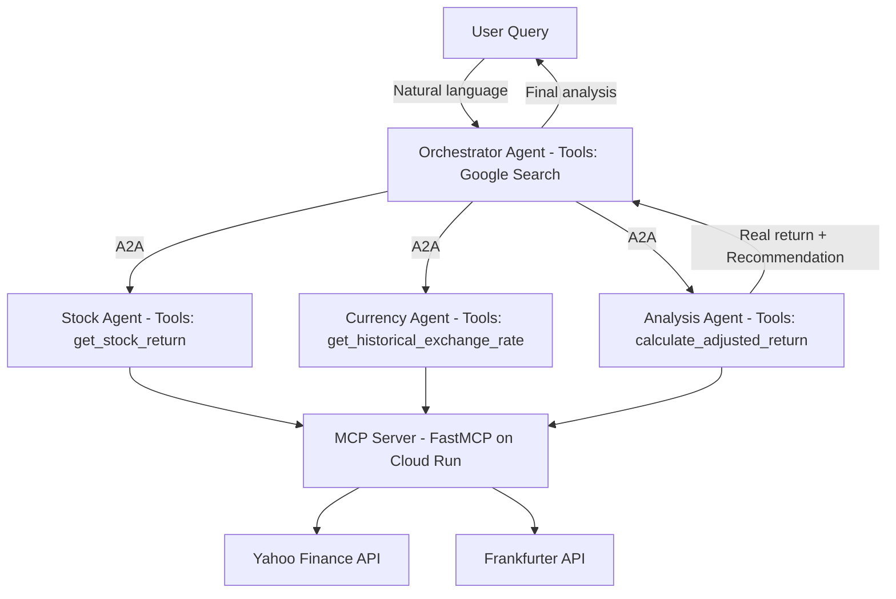

# Jarvis Investment Swarm

**Intelligent currency-adjusted investment analysis powered by Google ADK, MCP and A2A protocol.**

## What It Does

Jarvis helps foreign investors determine if a stock investment is truly profitable after accounting for currency exchange fluctuations.

**Example:** A Malaysian investor gains 7% from BBRI.JK but loses 5% to MYR/IDR appreciation — Jarvis calculates the real return of 1.9%.

**Formula:** `(1 + stock_return) / (1 + fx_appreciation) - 1`

## System Architecture


## Agent Profiles

| Agent | Role | Tools |
|-------|------|-------|
| Orchestrator | Coordinates all agents, handles web search | Google Search |
| Stock Agent | Fetches stock prices and capital gain % | get_stock_return via MCP |
| Currency Agent | Fetches historical exchange rates | get_historical_exchange_rate via MCP |
| Analysis Agent | Calculates real return after FX adjustment | calculate_adjusted_return via MCP |

## Tech Stack

- **Google ADK** — Agent orchestration
- **A2A Protocol** — Agent to agent communication
- **FastMCP** — MCP server for tool management
- **Google Cloud Run** — MCP server deployment
- **Gemini 2.5 Flash** — LLM backbone
- **Yahoo Finance** — Stock data
- **Frankfurter API** — Exchange rate data
- **FastAPI** — Web backend
- **Python 3.13**

## Setup Instructions

**Prerequisites**
- Python 3.13+
- Google Cloud account
- uv package manager

**Installation**
```bash
git clone https://github.com/kenrickfpv/KenrickSuyanto-InvestmentSwarm.git
cd KenrickSuyanto-InvestmentSwarm
uv sync
```

**Environment Variables**

Create a `.env` file:
```
GOOGLE_CLOUD_PROJECT=your-project-id
GOOGLE_CLOUD_LOCATION=us-central1
GOOGLE_GENAI_USE_VERTEXAI=true
ALPHA_VANTAGE_API_KEY=your-key
```

**Run**
```bash
gcloud auth application-default login
uv run uvicorn app.main:app --host localhost --port 8080
```

## Project Structure
```
/agents     - ADK agent definitions
/tools      - MCP server and financial tools
/app        - FastAPI web application
```

## Author

Kenrick Suyanto — GDG Gemini Nexus Hackathon 2026